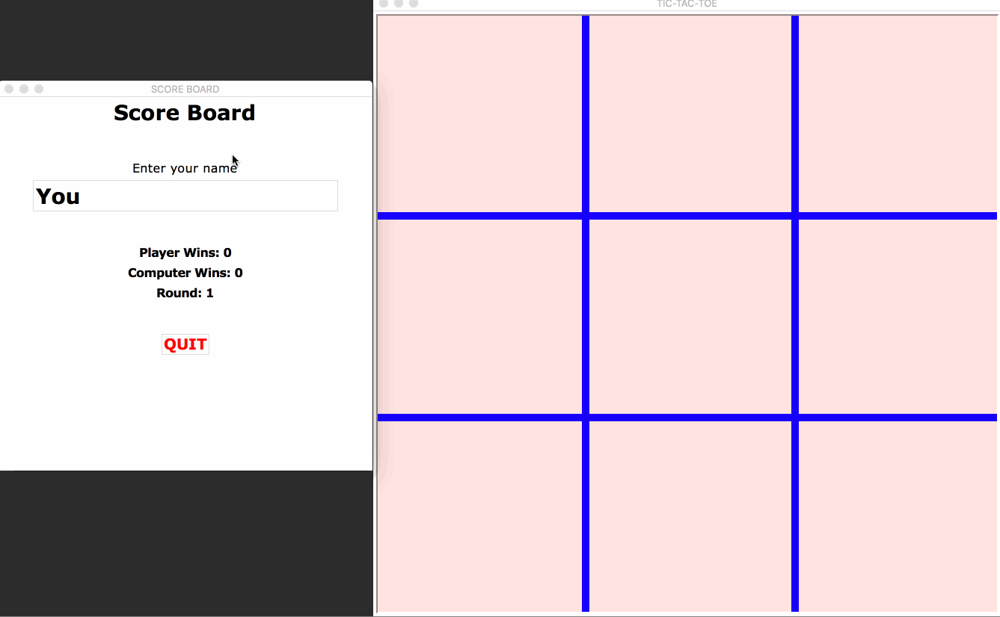

# Pre-work - Tippy

Final Project using Python's Turtle and Tkinter modules

Submitted by: Kevin Chen

Time spent: 10 hours spent in total

The game is fully developed, including all the functions such as draw_board, do_user_move, do_computer_move, and check_game_over, with some helper functions used as well. The project meets the basic requirements such as the user placement (O) and computer placement (X) and declaration of a winner, and repeat of the game. While the game does adapt when you expand the screen, it starts to glitch as well.

There are some artistic endeavors using turtle such as the color/shape of the grid, game pieces, and background. Some additional features include a smarter AI that attempts to occupy the corners and center areas. Additionally, there are other features that are implemented such as a tkinter screen for a score board and a more visually appealing UI. Regarding the implementation of the project, I used three classes: Board, Score, and Game to develop the game. I am currently satisfied with the state of the project because it has completed the basic functionality with additional features.

The most challenging aspect of the assignment would be implementing the draw_board function because it took time and some math to figure out where to place the grid lines and how to draw the "X" and "O" on the screen. At the beginning a list of tuples, representing the location of each grid line, and the list of tuples, representing the indexes of point (grid line), were used to implement the draw_board function, but this approach was not effective and is repetitive. Therefore, a for loop was implemented to loop through the positions of the board. Another challenging aspect was implementing the score board because using the tkinter class took some time to understand and implement into the game.

The most surprisingly easy function to implement was do_computer_move because it just involved using previous functions such as check_game_over to simulate whether to do the winning move or block the opponent from winning. The most prideful aspect of the project would be draw_board because even though it took a lot of effort to figure out, but it was an refreshing and stimulating journey to implement my approach. I probably wouldn't have approach the problem differently because I couldn't find another way to implement it to function correctly.

The instructions were clear and detailed enough as to not spoil any details on its implementation. There was enough support in developing the solution. The assignment was really interesting because it provided insight into a simple version of object orientated programming and the organization of functions in a program by leading the journey into figuring out the role of each function. For instance, the draw_board function would only have to draw the grid and its objects, while the check_game_over checks the status of the game. These separate functions all combine to support the functioning of the game. Using classes to develop the game was a good learning experience because it allowed me to understand object oriented programming in my own experience with trail and error. This allowed me to understand that separate classes/objects have their own fields/variables and their own roles that should not extend to other classes.

## Video Walkthrough 

Here's a walkthrough of implemented user stories:

GIF created with [LiceCap](http://www.cockos.com/licecap/).
